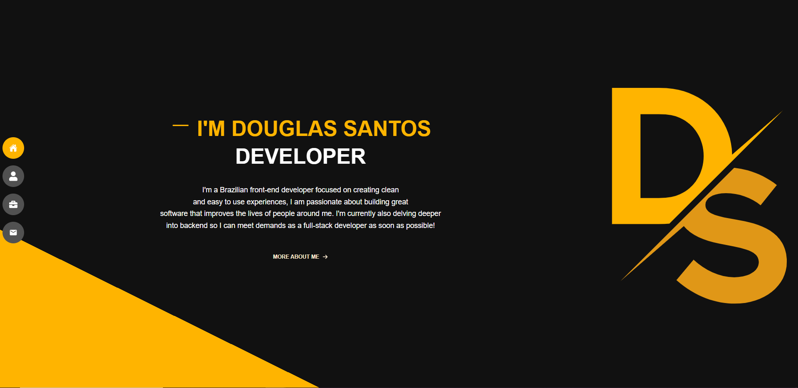

# Douglas Santos Portfolio

> Olá, esté é meu Portfolio!! Aqui falo um pouco sobre mim e meus projetos. Entre Em contato para mais informações.
> 
<h4 align="center"><a href="https://douglas-santos-portfolio.netlify.app/">Clique para visitar o projeto</a></h4>

## 💼 Tecnologias utilizadas

Para o desenvolvimento deste site utilizei as seguintes tecnologias:

- Typescript;
- Styles-Components;
- React;
- Vite;

## Autor

<table>
  <tr>
    <td align="center">
      <a href="https://github.com/D0uglasSantos" title="Douglas Santos">
         
        
          <b>Douglas Santos</b>
        
      </a>
    </td>
  </tr>
</table>

## 📝 Licença

Esse projeto está sob licença. Veja o arquivo [LICENÇA](LICENSE.md) para mais detalhes.
